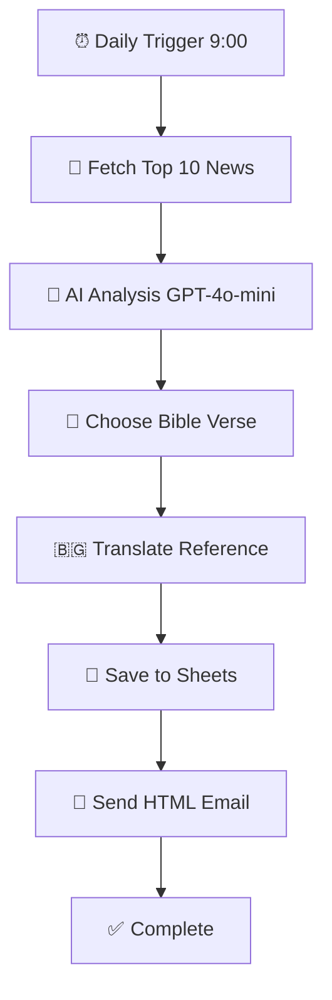

# 📁 Пълна структура на GitHub проекта

## Файлова структура

```
bible-verse-daily-email/
│
├── 📄 Code.gs                    # Основен Google Apps Script код
├── 📘 README.md                  # Главна документация
├── 🚀 QUICKSTART.md             # Бърз старт за 5 минути
├── 🤝 CONTRIBUTING.md           # Ръководство за contributors
├── 📋 CHANGELOG.md              # История на версиите
├── ⚖️ LICENSE                    # MIT лиценз
├── 🙈 .gitignore                # Git ignore правила
│
├── 📁 .github/                  # GitHub специфични файлове
│   ├── ISSUE_TEMPLATE/
│   │   ├── bug_report.md
│   │   └── feature_request.md
│   └── PULL_REQUEST_TEMPLATE.md
│
├── 📁 docs/                     # Допълнителна документация
│   ├── API.md                   # API документация
│   ├── SETUP.md                 # Детайлна инсталация
│   ├── TROUBLESHOOTING.md       # Често срещани проблеми
│   └── images/
│       ├── email-preview.png
│       ├── sheets-structure.png
│       └── trigger-setup.png
│
└── 📁 examples/                 # Примерни конфигурации
    ├── custom-prompts.js        # Алтернативни AI промпти
    ├── email-templates.html     # Допълнителни HTML темплейти
    └── advanced-config.js       # Напреднали настройки
```

---

## 📝 Описание на основните файлове

### 🔧 Code.gs
**Размер:** ~300 реда  
**Съдържание:**
- Главна логика на приложението
- AI интеграция (OpenRouter)
- Google Sheets операции
- Gmail изпращане
- Тригер функции

### 📘 README.md
**Разделни:**
- 🎯 Какво прави проектът
- ✨ Характеристики
- 🛠️ Технологии
- 📋 Предварителни изисквания
- 🚀 Инсталация (7 стъпки)
- 📊 Google Sheets структура
- 🧪 Тестване
- 📧 Пример имейл
- 🔍 Troubleshooting
- 💡 Бъдещи подобрения
- 📄 Лиценз

### 🚀 QUICKSTART.md
**Цел:** Бързо стартиране за 5 минути  
**Стъпки:** 7 (всяка с времева оценка)
- Включва копи-пейст инструкции
- Визуални примери
- Бързи решения на проблеми

### 🤝 CONTRIBUTING.md
**Съдържа:**
- Как да започнеш
- Code style guidelines
- Commit съобщения (conventional commits)
- Pull Request процес
- Докладване на бъгове
- Области за принос

### 📋 CHANGELOG.md
**Формат:** Keep a Changelog  
**Версии:**
- [1.0.0] - Първоначален release
- [Unreleased] - Планирани features

### ⚖️ LICENSE
**Тип:** MIT License  
**Разрешава:**
- Комерсиална употреба
- Модификация
- Разпространение
- Частна употреба

### 🙈 .gitignore
**Изключва:**
- API ключове и secrets
- IDE конфигурации
- OS специфични файлове
- Log файлове
- Node modules

---

## 🏗️ Структура на кода (Code.gs)

```javascript
// ===================== КОНФИГУРАЦИЯ =====================
CFG object (3 настройки)

// ===================== SCRIPT PROPERTIES =====================
getOpenRouterKey_()
getMailTo_()
getFromName_()

// ===================== GOOGLE SHEETS =====================
getVersesSheet_()
appendVerseRow_()

// ===================== НОВИНИ =====================
fetchBulgarianNews_()

// ===================== ИЗБОР НА СТИХ ОТ ИИ =====================
chooseBibleVerseFromNews_()

// ===================== ПРЕВОД И ФОРМАТИРАНЕ =====================
mapBookToBg_()
toBgVerse_()

// ===================== HTML ИМЕЙЛ =====================
renderReportHtml_()
sendReportEmail_()

// ===================== ГЛАВНА ФУНКЦИЯ =====================
sendDailyVerse()        // Автоматично извикване

// ===================== ИНСТАЛАЦИЯ НА TRIGGER =====================
setupDailyTrigger()     // Еднократна настройка

// ===================== ТЕСТОВА ФУНКЦИЯ =====================
testSendVerse()         // Ръчно тестване
```

---

## 📊 Google Sheets структура

### Лист: **Verses**

| # | Колона | Тип | Описание |
|---|--------|-----|----------|
| A | timestamp | Date | Дата и час на изпращане |
| B | version | Text | Библейска версия (en-kjv) |
| C | book | Text | Име на книга (английски) |
| D | chapter | Number | Номер на глава |
| E | verse | Number | Номер на стих |
| F | text | Text | Текст на стиха (английски) |
| G | ref | Text | Референция (български) |
| H | sent_to | Email | Имейл получател |
| I | link | URL | Линк към BG1940 превод |
| J | news_summary | Text | Резюме на новините |

**Пример ред:**
```
2025-01-04 09:00:15
en-kjv
john
3
16
For God so loved the world...
Йоан 3:16
user@example.com
https://www.biblegateway.com/...
България очаква нова година; Икономиката расте; ...
```

---

## 🔄 Workflow схема



---

## 🎨 HTML Email структура

```html
<!DOCTYPE html>
<html>
  <head>
    <style>
      /* Responsive design */
      /* Clean typography */
      /* Beautiful colors */
    </style>
  </head>
  <body>
    <div class="wrap">
      <h2>📖 Стих за деня</h2>
      <p class="text">"[Bible verse text]"</p>
      <p class="ref">
        <a href="[BibleGateway URL]">— [Reference] (BG1940)</a>
      </p>
      <div class="note">
        Избран на база топ 10 новини от България...
      </div>
    </div>
  </body>
</html>
```

---

## 🔐 Script Properties настройка

В **Apps Script → ⚙️ Project Settings → Script Properties**:

| Property | Example Value | Задължително |
|----------|---------------|--------------|
| `OPENROUTER_API_KEY` | `sk-or-v1-abc123...` | ✅ Да |
| `MAIL_TO` | `user@example.com` | ✅ Да |
| `MAIL_FROM_NAME` | `Bible Verse Bot` | ❌ Не (default) |

---

## 🚦 Development Roadmap

### ✅ Phase 1: Core Features (v1.0.0) - DONE
- [x] AI verse selection
- [x] Email delivery
- [x] Google Sheets logging
- [x] Daily automation

### 🔄 Phase 2: Enhancements (v1.1.0)
- [ ] Multiple language support
- [ ] Custom email templates
- [ ] Advanced analytics

### 🔮 Phase 3: Integrations (v2.0.0)
- [ ] Telegram bot
- [ ] Slack integration
- [ ] Discord webhook
- [ ] SMS delivery

### 🌟 Phase 4: Platform (v3.0.0)
- [ ] Web dashboard
- [ ] User accounts
- [ ] Subscription management
- [ ] API for developers

---

## 📞 Quick Links

- **Live Demo:** [Screenshots in /docs/images/](docs/images/)
- **Issues:** [Report bug or request feature](../../issues)
- **Discussions:** [Ask questions](../../discussions)
- **Releases:** [Version history](../../releases)
- **Wiki:** [Extended documentation](../../wiki)

---

**Готово за GitHub! 🚀**

Всичко е подготвено за публикуване. Не забравяй да:
1. Промениш URL-ите с твоето GitHub username
2. Добавиш screenshots в `/docs/images/`
3. Star-неш проекта когато го качиш! ⭐